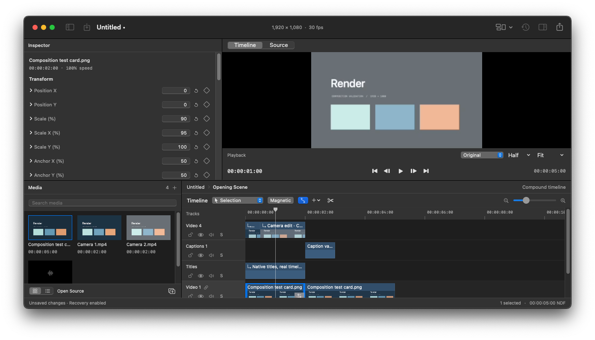

# Render

A native, non-destructive macOS video editor built with SwiftUI, AppKit, AVFoundation and a Metal-backed Core Image compositor. Render is an early-stage long-term editor project, not yet a production replacement for an established NLE.



## Requirements

Apple Silicon · macOS 14+ · Xcode 16.4+ for source builds. No external runtime packages.

## Working editing path

1. Import video, audio or still images (⌘I or Finder drop).
2. Double-click media to append, or drag it onto a compatible timeline track.
3. Scrub the ruler, play with Space, select with A, blade with B, split with ⌘B. Drag selected clips to move, drag their edges to trim, Shift-click for multi-selection. R selects ripple trim, O roll, Y slip, U slide, G range and Z zoom (Shift-click zooms out). Select a range and press Delete or Shift-Delete to ripple it.
4. Adjust transform, opacity, volume, speed and effects in the inspector. Diamonds create property and effect keyframes. The Animation inspector edits key timing, values, linear/ease/hold interpolation, and keyframe copy/paste. Undo/redo uses ⌘Z / ⇧⌘Z.
5. Save a `.renderproject` document. Original media is referenced without copying. Right-click a media item to relink a moved file.
6. Right-click video media to generate a 720p H.264 proxy or source-size ProRes optimized file. Select Original, Proxy or Optimized in the viewer; the toolbar task button shows generation progress and cancellation.
7. Add a Title or Caption from the Timeline menu; edit text and styling in the inspector. Import/export UTF-8 SRT captions from File.
8. Add transitions between adjacent video clips or audio fades in the inspector. Select two recordings and choose Timeline → Synchronize Audio to review an alignment.
9. Select a video clip and choose Timeline → Create Multicam Source to configure imported cameras and source offsets. Click a camera preview to cut at the playhead, or replace a segment’s camera in the inspector.
10. Create a compound from selected clips with ⌥⌘G. Open its source timeline from the inspector or context menu, edit its contents, and return using the breadcrumbs. Saving and export always include the full project.
11. Use the workspace toolbar menu to switch Editing, Effects, Audio or Viewer Only layouts. The viewer’s Full/Half/Quarter setting changes preview resolution independently of source proxies.
12. Export H.264, HEVC or ProRes. H.264/HEVC offer quality presets and custom target bitrates; preview and export share the compositor.

Includes multiple video/audio tracks, lock/visibility/mute/solo, snapping, markers, insert, ripple delete, clip clipboard, asynchronous thumbnails/waveforms, recent projects, atomic saves and recovery. Effects include exposure, brightness, contrast, saturation, highlights, shadows, temperature, tint, blur, sharpen, vignette, opacity and chroma key. Rectangle, ellipse and editable polygon masks can limit each effect; keying includes screen colour, similarity, softness and spill suppression. Supported decoding depends on macOS's installed codecs.

## Build and validate

```sh
swift build
swift test
scripts/package.sh
open dist/Render.app
```

The package script builds an ARM64 Release bundle, generates the icon, ad-hoc signs it, creates and verifies the DMG, checks an installed copy, and runs a launch smoke check. GitHub Actions runs core tests plus synthetic-media preview/export integration tests. DMGs are release assets, never committed binaries.

[Architecture and milestones](docs/DEVELOPMENT.md) · [Manual testing and limitations](docs/MANUAL_TESTS.md) · [Installation](docs/INSTALL.md)

## Release status

Version 0.22.0 adds clip EQ, compression, sample peak limiting and gating with shared playback/export processing. See [audio processing](docs/AUDIO_PROCESSING.md) for ordering and limitations. Version 0.21.1 corrects leading-handle trims while preserving animation and connection timing. Version 0.21.0 adds continuous reverse preview for compositions that cannot reverse natively. Version 0.20.0 adds real decoded-input peak/RMS audio meters. Version 0.19.0 adds independent effects/audio panes, workspace presets and Full/Half/Quarter preview resolution. Version 0.18.0 adds compound creation, nested timeline editing, root-document persistence, cross-context undo and live nested rendering/audio. Version 0.17.0 introduced the hierarchical GPU compositor. Version 0.16.0 limits timeline track views and filmstrip requests to the vertical viewport. Version 0.15.0 added persistent multicam sources, paged camera previews and undoable angle cuts. Camera offsets are manual and cuts pause while rebuilding playback. Version 0.14.1 preserves focused inspector drafts when saving and retains fades on detached audio. Version 0.14.0 added H.264/HEVC quality presets, custom bitrates and output-size estimates; 0.13.0 added reviewed audio synchronization; 0.12.0 added clip fade curves. Earlier releases introduced cut transitions, filmstrips, animated geometry, magnetic editing, titles/captions, proxies, keyframes, chroma key and effect masks. See the versioned release notes for validation and limitations.

This release is ad-hoc signed and not notarized. Physical-device performance profiling and the manual release checklist remain required before production use.

MIT License.

[Download the latest release](https://github.com/Ninnja10563/Render/releases) · [Editing tool semantics](docs/EDITING.md)
